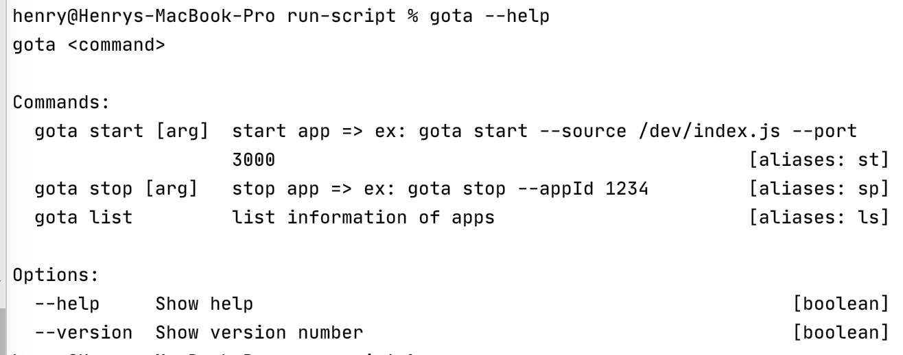
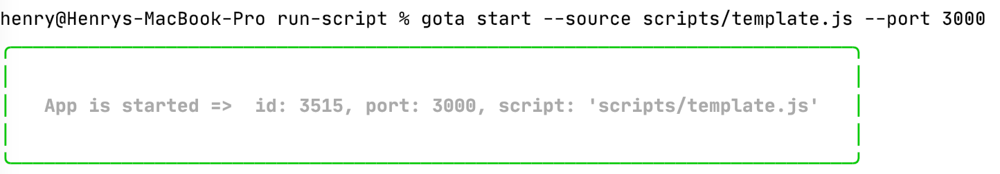
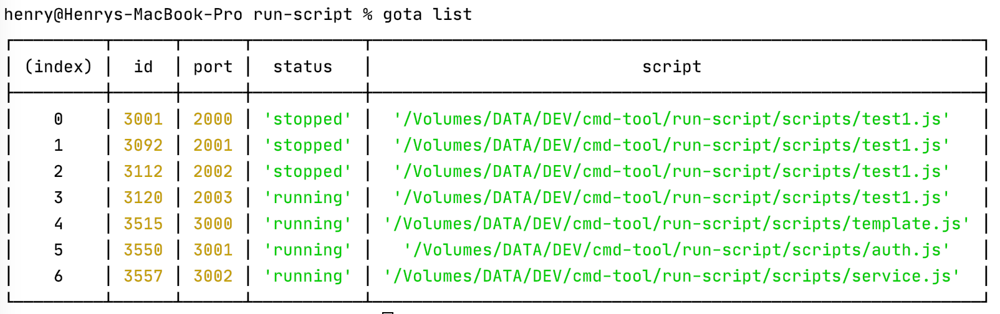
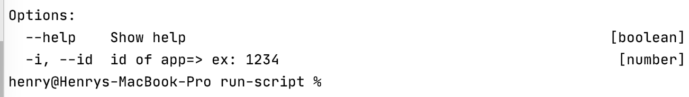
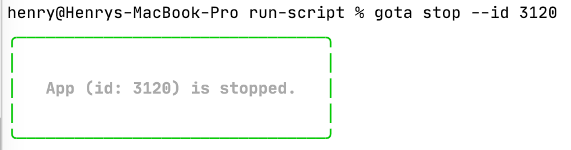
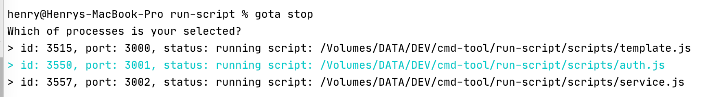
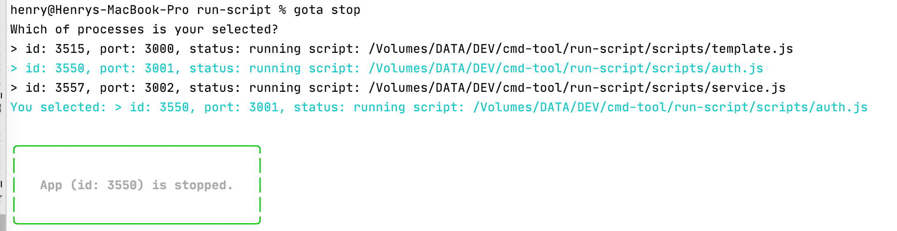

# Gota Run App

A simple CLI tool for ensuring that a given script runs continuously.

## Installing

``` bash
  $ [sudo] npm i -g @gota/run-app
```
## Usage
### Help
``` bash
  $ gota --help
```


### Start App
``` bash
 $ gota start -s <source> -p <port>
```
or
``` bash
 $ gota start --source <source> --port <port>
```
``` bash
Options:
  --help        Show help                                              [boolean]
  -s, --source  main script of app=> ex: /dev/index.js       [string] [required]
  -p, --port    listener port => ex: 3000                    [number] [required]
```
Ex:
``` bash
  $ gota start --source scripts/template.js --port 3000
```


### List All Apps
``` bash
 $ gota list
```
EX:


### Stop App
``` bash
 $ gota stop -i <id>
```
or
``` bash
 $ gota stop --id <id>
```
If you don't remember id, you don't need to put id.
``` bash
 $ gota stop --id <id>
```
gota


EX1:


EX2: don't input id, there is a selection appeared.


select one of them and the selected app will be stopped.
